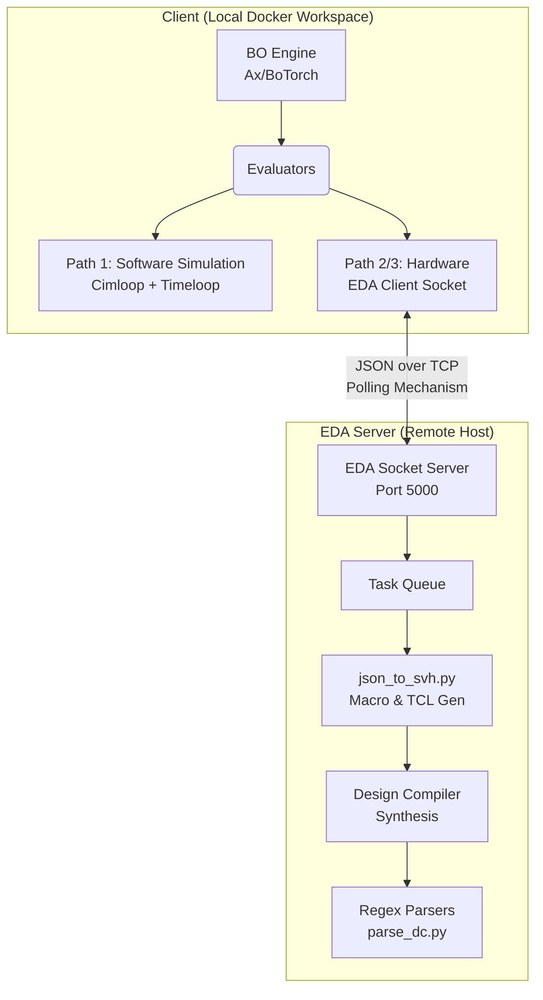
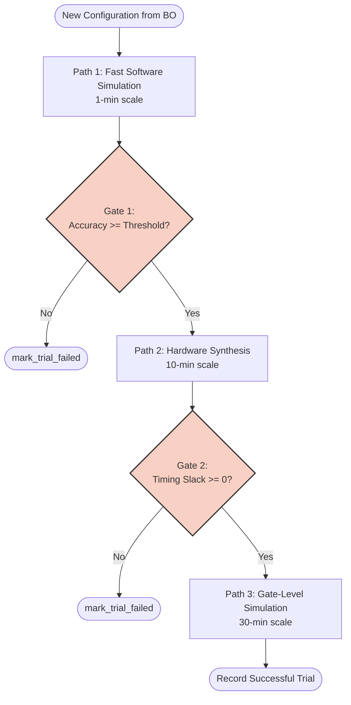
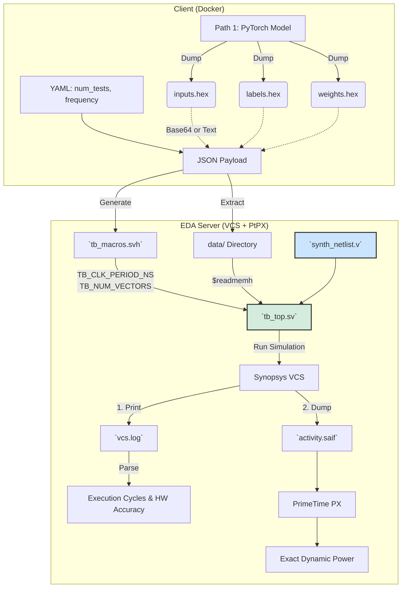
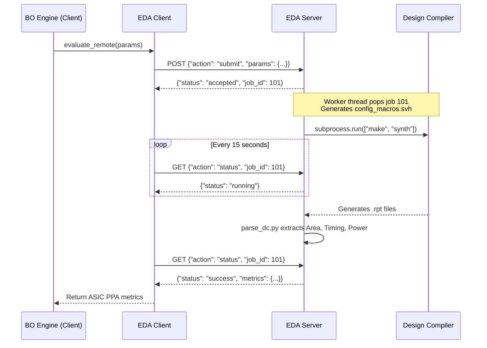
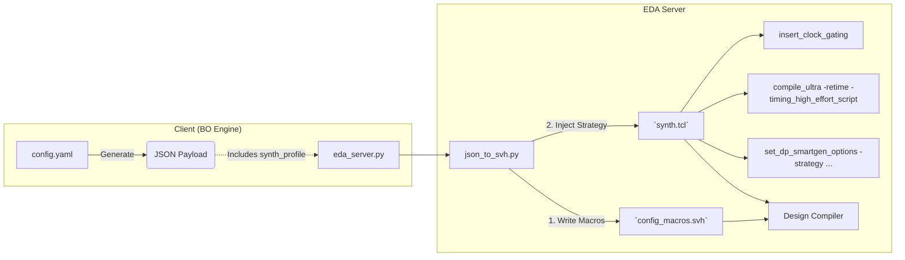

# Full-Stack Accelerator Optimization Framework

**Focus:** Multi-fidelity Design Space Exploration (DSE) for HDnn-PIM Architecture  
**Status:** Phase 2 (Baseline Exploration Flow) Implemented | Phase 3 (Verification & EDA DSE) Planning

---

## 1. Project Overview & Exploration Strategy

This project builds an automated, closed-loop Design Space Exploration (DSE) framework to optimize a parameterized Processing-in-Memory (PIM) accelerator for Hyperdimensional Neural Networks (HDnn).

### Core Algorithm: Bayesian Optimization (BO)
The hardware design space is high-dimensional, and physical hardware evaluations (synthesis/simulation) are highly expensive. BO is chosen for its sample-efficient nature, effectively balancing **exploration** and **exploitation**. 
- **Multi-Objective Target:** Maximize Hypervolume across four metrics (Accuracy, Energy, Timing, Area) to form the Pareto frontier.
- **Decoupled Execution:** The BO "brain" is decoupled from the hardware "muscle". The EDA Server acts as a Black-box API.

---

## 2. System Architecture (Thin-Client Model)

Due to strict EDA tool licensing constraints, local execution of hardware synthesis is not possible. The framework implements a **Black-Box API** pattern: the local Docker client only transmits parameter JSON, and the remote EDA server executes synthesis and returns distilled numerical metrics.



---

## 3. Multi-Fidelity Evaluation Pipeline

To overcome the evaluation bottleneck, the framework employs a three-tiered pipeline with **Early Stopping (Gatekeeping)** mechanisms.



### 3.1 Path 1: Fast Software Simulation
* **Engine:** `path1_software.py` (Calls Cimloop + Timeloop)
* **Gate 1:** If PyTorch accuracy is below the defined constraint, the trial is marked as failed without penalty injection.
* **Data Prep (Phase 3):** Dumps model weights, inputs, and labels to HEX files for downstream verification.

### 3.2 Path 2: Hardware Synthesis (Client-Side Stitching)
* **Engine:** `path2_hardware.py`
* **Stitching Logic:** Since the RRAM portion lacks RTL, Path 2 stitches ASIC data (from the EDA server) with RRAM data (re-run locally via Cimloop).
  * `Total Timing = ASIC Delay (EDA) + RRAM Delay (Cimloop)`
  * `Total Energy = ASIC Power (EDA) * Total Timing + RRAM Energy (Cimloop)`
* **Gate 2:** If the synthesized netlist violates timing constraints (`slack < 0`), the trial fails.

### 3.3 Path 3: Gate-Level Simulation (Verification)
* **Engine:** `path2_hardware.py` (with Path 3 flag) calling EDA Server (VCS + PtPX).
* **Cycle-accurate data:** VCS provides actual execution cycle count, replacing Timeloop's estimate.
* **Final Energy:** `(asic_dynamic_power_mW * total_time_us) + rram_energy_uJ`

#### Phase 3 Testbench Architecture & Data Flow
Because the EDA server is a black box, the client must generate the test data dynamically and send it to the server to be read by the Testbench (`tb_top.sv`).



**Testbench Parameter Mapping:**
| Original Parameter (YAML) | Testbench Macro / Parameter | Purpose in TB |
| :--- | :--- | :--- |
| `frequency` | `TB_CLK_PERIOD_NS` | Clock generation: `# (TB_CLK_PERIOD_NS / 2.0) clk = ~clk;` |
| `num_tests` | `TB_NUM_VECTORS` | Loop bounds for reading test vectors |
| `dataset` | `TB_INPUT_FILE` | Hex file path for input features |
| (New) | `TB_GOLDEN_FILE` | Hex file path for golden labels (to verify HW accuracy) |
| (New) | `TB_WEIGHT_FILE` | Hex file path for pre-trained HDnn weights |

---

## 4. EDA Server Protocol (Black-Box API)

To navigate restrictive corporate firewalls, large `.rpt` files are never transferred. The EDA Server "locally extracts" metrics and returns a tiny JSON payload.



---

## 5. Parameter Space Classification & Mapping

Tunable parameters are centrally defined in `workspace/conf/params_prop/cimloop.yaml`.

### 5.1 Software Parameter Categorization
* **Category 1: Hardware-Related (Alters RTL Geometry & Memory)**
  * `hd_dim`, `inner_dim`, `reram_size`
  * Spatial mapping: `cnn_x_dim_1/2`, `encoder_x_dim/y_dim`, etc.
* **Category 2: Training & Dataflow-Related (No RTL Impact)**
  * `dataset`, `frequency`, `hd_epochs`, `cnn_epochs`
  * `cnn` (Fixed flag: true = CNN+HD, false = HD only)
* **Category 3: Synthesis Strategy (EDA Impact)**
  * `synth_profile`: Groups DC synthesis flags to explore the trade-off between strict timing and low power/area.

### 5.2 Synthesis Flags DSE (Config & TCL Mapping)

By exposing synthesis flags to the BO engine, we can explore the Pareto front between RTL architecture and EDA optimization strategies. The parameter `synth_profile` directs the TCL generation scripts.

| `synth_profile` (YAML) | DC TCL Commands Generated | Strategy Goal |
| :--- | :--- | :--- |
| `timing_aggressive` | `compile_ultra -retime -timing_high_effort_script`<br/>`set_dp_smartgen_options -optimization_strategy timing` | Meet strict clock periods at the cost of area/power. |
| `power_aggressive` | `insert_clock_gating`<br/>`compile_ultra -area_high_effort_script`<br/>`set_dp_smartgen_options -optimization_strategy area` | Minimize area and dynamic power. |
| `balanced_default` | `insert_clock_gating`<br/>`compile_ultra` (default) | Standard compilation. |
| `exact_map` | `compile_ultra -exact_map -no_autoungroup` | Preserves hierarchies for precise logic mapping. |



### 5.3 Software-to-RTL Mapping Table
Implemented in `eda_server_scripts/json_to_svh.py`.

| Software Parameter | Hardware Macro (`config_macros.svh`) | Mathematical Conversion |
| :--- | :--- | :--- |
| `reram_size` | `` `RRAM_ROW_ADDR_WIDTH `` | `ceil(log2(reram_size))` |
| `hd_dim` | `` `HV_LENGTH `` | Direct |
| `inner_dim` | `` `INNER_DIM `` | Direct |
| `cnn_x_dim_1` × `cnn_y_dim_1` | `` `INPUTS_NUM `` (Layer 1) | Product |
| `encoder_x_dim` × `encoder_y_dim` | `` `ENC_INPUTS_NUM `` | Product |
| `hd_dim` / (`encoder_x_dim` × `encoder_y_dim`) | `` `HV_SEG_WIDTH `` | Integer Division |
| `frequency` | DC TCL `create_clock -period` | `1e9 / frequency` (ns) |

---

## 6. Directory Structure

```text
Full-Stack-Accelerator-Optimization/
│
├── run_exploration.py                 # Main entry point (CLI args for Path 2/3)
│
├── workspace/                         # Local execution environment
│   ├── dse_framework/                 # [Core] DSE Control Center
│   │   ├── evaluators/                # Evaluator Wrappers (Path 1 & 2)
│   │   ├── network/                   # Socket Client (Polling Protocol)
│   │   └── core_algorithm/            # BO Engine & Dynamic Normalizer
│   │
│   ├── HDnn-PIM-Opt/                  # Pure software evaluator (Path 1 / Cimloop)
│   └── conf/                          # Hydra configurations (YAML)
│
└── eda_server_scripts/                # Deploy on remote EDA Server
    ├── eda_server.py                  # Socket Server (Queue + Timeout)
    ├── json_to_svh.py                 # Macro & TCL generation
    └── parsers/                       # DC and VCS regex parsers
```

---

## 7. Implementation To-Do / Status

### Phase 2: Automation Baseline [✅ COMPLETED]
- [x] Parameter Mapping Table & `json_to_svh.py`.
- [x] `eda_server.py` with Task Queue and strict 30-min timeouts.
- [x] Regex parsers for DC reports (`parse_dc.py`).
- [x] Polling client (`eda_client.py`).
- [x] Client-side data stitching (`path2_hardware.py`).
- [x] Ax/BoTorch Engine refactoring (`bo_engine.py` + dynamic normalization).

### Phase 3 & 4: Verification & Full BO Integration [⏳ PENDING]
- [ ] Implement `synth_profile` logic in `json_to_svh.py` to generate TCL commands.
- [ ] Establish VCS → PtPX SAIF handoff pipeline (`parse_vcs.py`).
- [ ] Create parameterized `tb_top.sv` using macros (`TB_CLK_PERIOD_NS`, etc.).
- [ ] Implement hex data dumping in Path 1 and transmission in JSON payload.
- [ ] Define hard boundary constraints for all BO parameters (min/max bounds).
- [ ] **Cross-Path Calibration:** Use Path 2/3 physical data to calibrate Path 1 analytical models.
