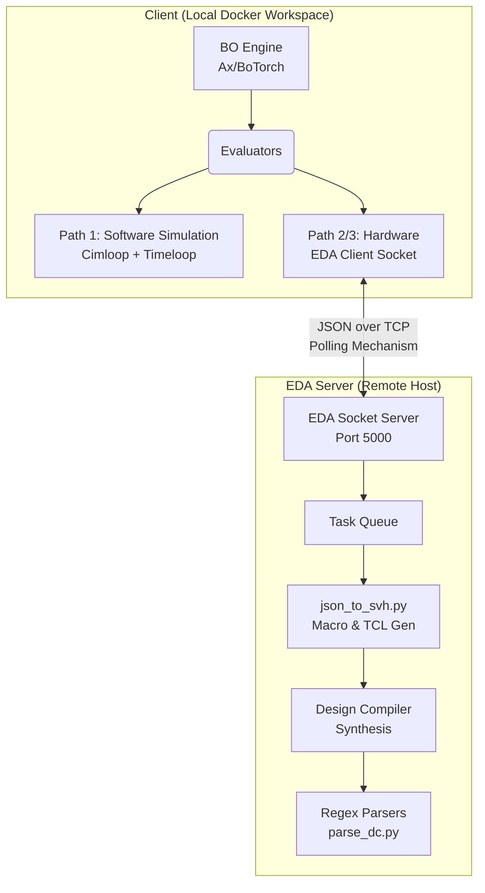
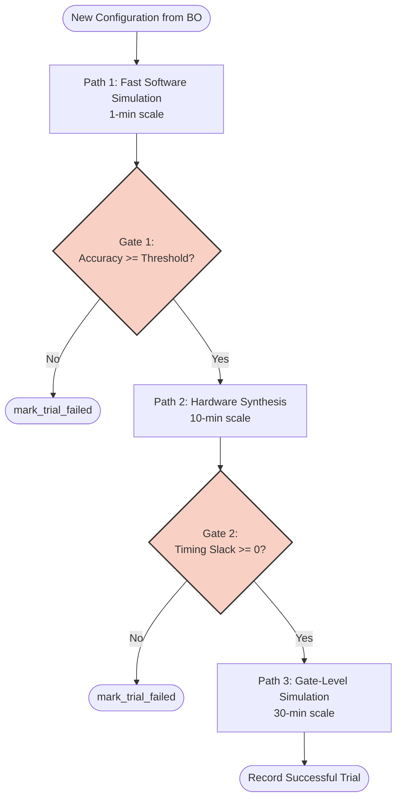
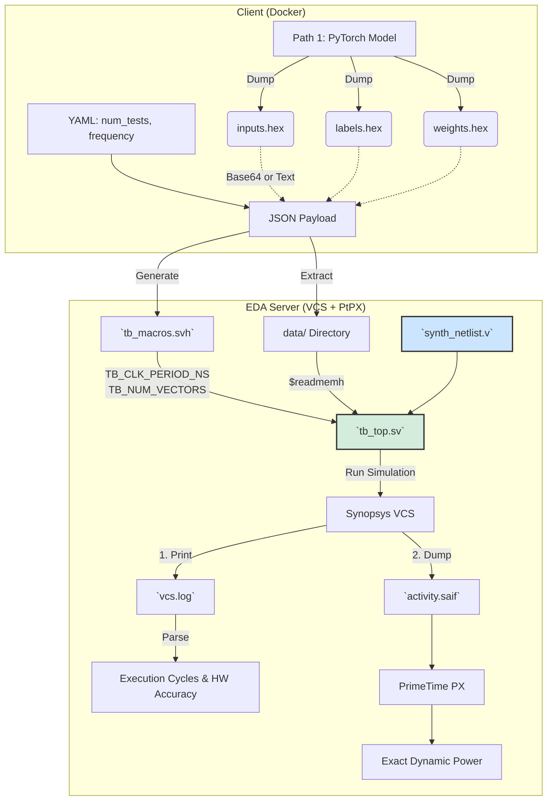
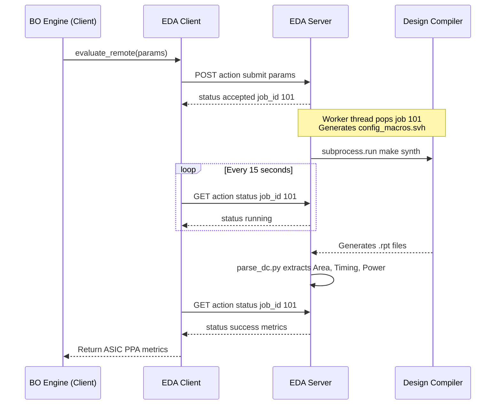
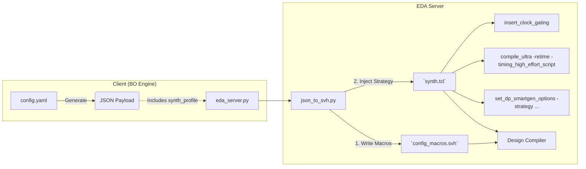

# README Diagrams (Mermaid)

This file contains all Mermaid diagrams referenced from [README.md](README.md). Render this file in a Markdown viewer that supports Mermaid (e.g. GitHub, VS Code) to see the figures.

---

## 1. System Architecture (Thin-Client Model)

*Referred from README §2.*

---

## 2. Multi-Fidelity Evaluation Pipeline

*Referred from README §3.*

---

## 3. Phase 3 Testbench Architecture and Data Flow

*Referred from README §3.3.*

---

## 4. EDA Server Protocol (Polling Sequence)

*Referred from README §4.*

---

## 5. Synthesis Profile to TCL Injection (Config Flow)

*Referred from README §5.2.*

