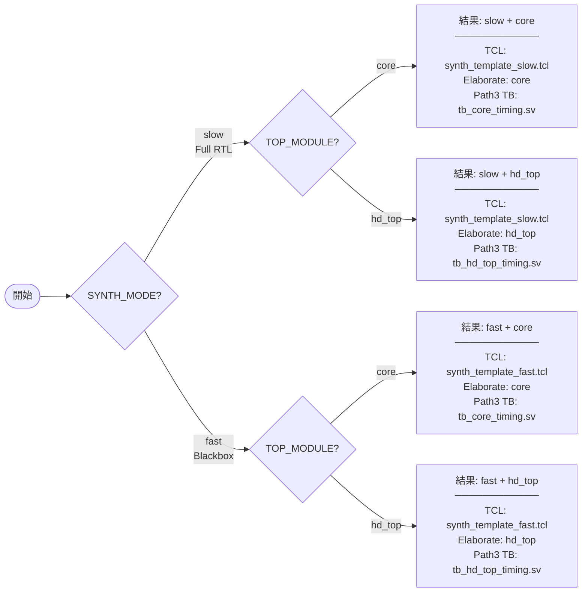
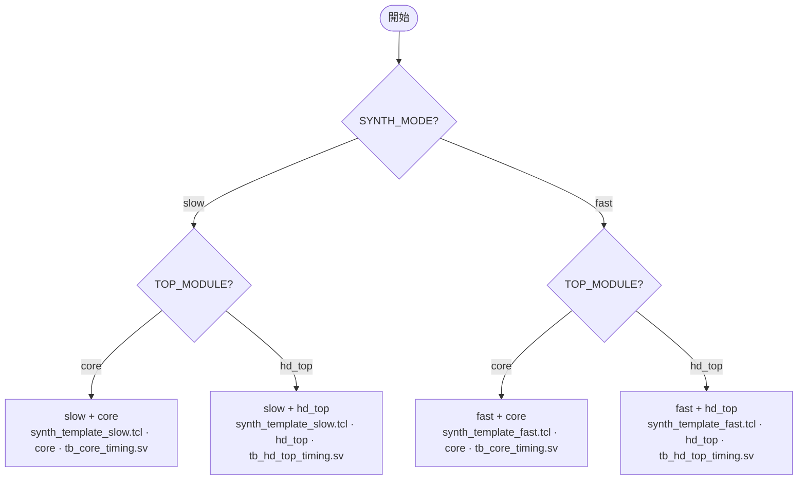

# Synthesis 決策圖：SYNTH_MODE × TOP_MODULE

EDA 合成與 gate-level 模擬的兩階決策：先選 **SYNTH_MODE**（slow / fast），再選 **TOP_MODULE**（core / hd_top），得到四種組合之一。

---

## Mermaid 決策圖（橫向 LR）



---

## Mermaid 決策圖（直向 TB）



---

## 2×2 決策矩陣（文字版）

|  | **TOP_MODULE = core** | **TOP_MODULE = hd_top** |
|--|------------------------|-------------------------|
| **SYNTH_MODE = slow** | **slow + core**<br/>• TCL: `synth_template_slow.tcl`<br/>• Elaborate: `core`<br/>• Path 3 TB: `tb_core_timing.sv`<br/>• 全 RTL（含 PatterNet/SRAM），完整 wrapper | **slow + hd_top**<br/>• TCL: `synth_template_slow.tcl`<br/>• Elaborate: `hd_top`<br/>• Path 3 TB: `tb_hd_top_timing.sv`<br/>• 全 RTL，僅 HD 核心 |
| **SYNTH_MODE = fast** | **fast + core**<br/>• TCL: `synth_template_fast.tcl`<br/>• Elaborate: `core`<br/>• Path 3 TB: `tb_core_timing.sv`<br/>• PatterNet/SRAM 黑盒，只分析可變 HD 模組 | **fast + hd_top**<br/>• TCL: `synth_template_fast.tcl`<br/>• Elaborate: `hd_top`<br/>• Path 3 TB: `tb_hd_top_timing.sv`<br/>• 最快 DSE 範圍（黑盒 + 僅 HD core） |

---

## 維度說明

| 維度 | 選項 | 意義 |
|------|------|------|
| **SYNTH_MODE** | `slow` | 全 RTL 合成：PatterNet、SRAM、chip_interface 皆由 RTL 合成，DC 時間較長、結果較完整。 |
| | `fast` | 黑盒模式：PatterNet/SRAM 不重跑合成，只分析 HD 核心等可變部分，DC 較快。 |
| **TOP_MODULE** | `core` | 合成/模擬頂層為 `core`（完整 wrapper，含 chip_interface + hd_top）；Path 3 用 `tb_core_timing.sv`。 |
| | `hd_top` | 合成/模擬頂層為 `hd_top`（僅 HD 核心）；Path 3 用 `tb_hd_top_timing.sv`，通常較快。 |

---

## 指令對應

```bash
# EDA Server / Makefile 傳入方式
make synth SYNTH_MODE=slow   TOP_MODULE=core
make synth SYNTH_MODE=fast   TOP_MODULE=hd_top
make sim   SYNTH_MODE=slow   TOP_MODULE=hd_top
```

BO 參數經 `json_to_svh.py` 與 EDA Server 傳遞：`params["synth_mode"]`、`params["top_module"]`（來自 `run_exploration.py --top-module` 與 config）。
