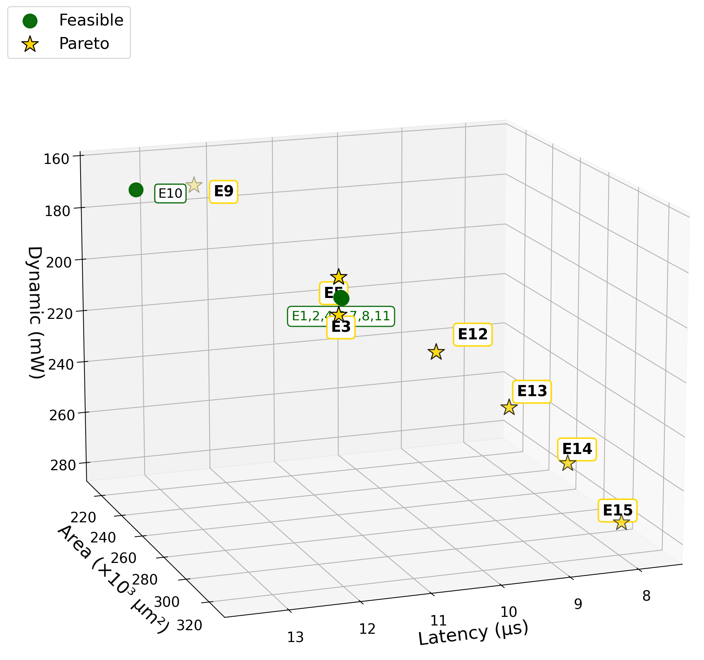
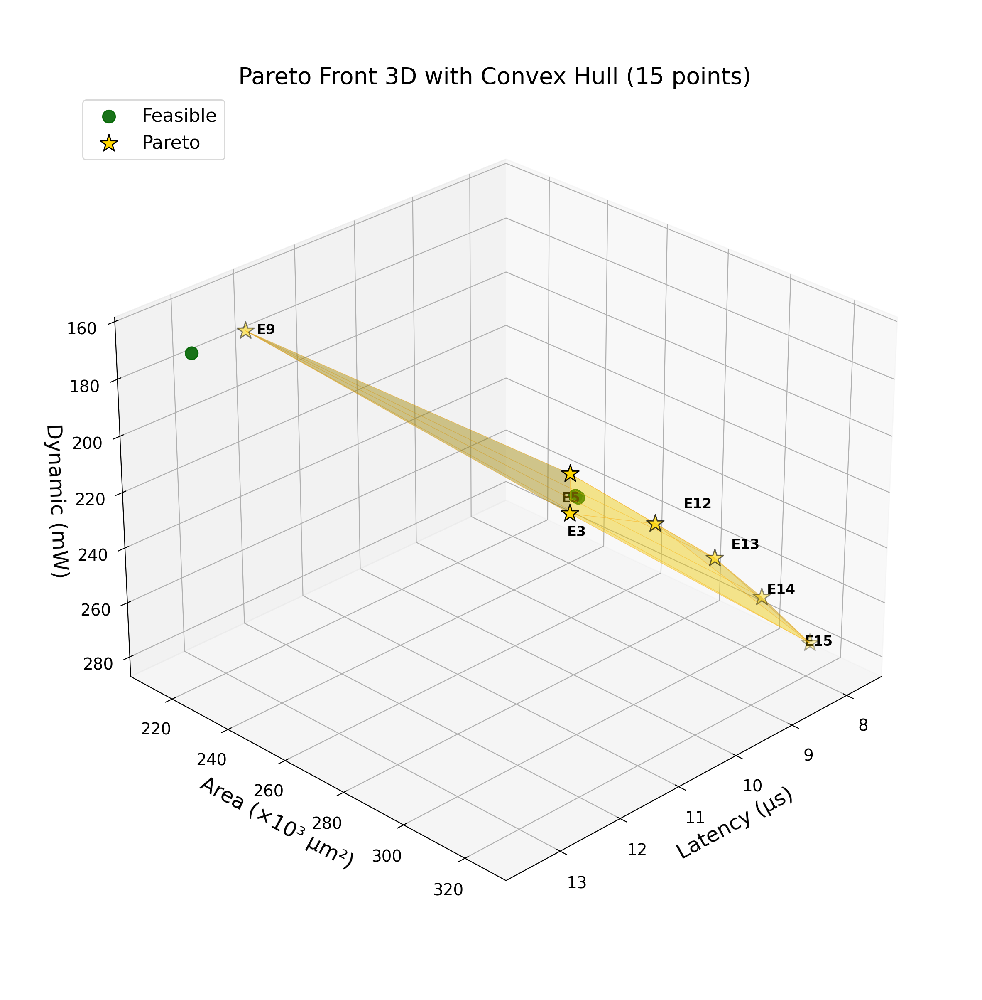
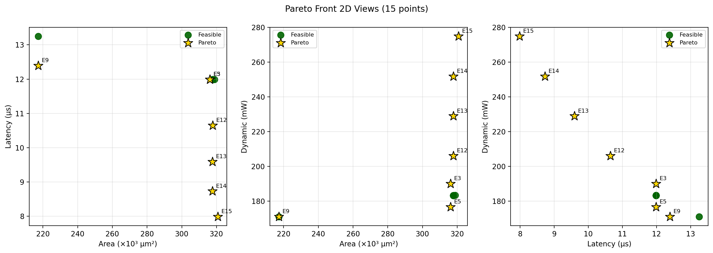

# 4. 實驗設定與結果 (Experimental Setup and Results)

本章說明評估指標與**差異化實驗組別設計**，並依實驗組別呈現 15 點 DSE 結果。評估環境與搜尋空間定義見**第 3 節 3.5**。本研究採用**固定參數配置**（非 BO 隨機採樣）進行系統性探索，共 **15 個有效實驗點**。

---

## 4.1 評估指標 (Evaluation Metrics)

**表 4-1：四維評估指標**

| 指標 | 方向 | 定義 | 單位 |
| :--- | :--- | :--- | :--- |
| p1_energy | 最小化 | Path 1 軟體模擬能量 | µJ |
| p1_area | 最小化 | Path 1 軟體模擬面積 | mm² |

**三階段管道與資料來源**：Path 1（軟體模擬）一律執行；Gate 1 通過後執行 Path 2（邏輯合成）；Gate 2 通過後可選執行 Path 3（閘級模擬）。後階段可覆蓋前階段對應指標。

**表 4-1a：四維指標之階段貢獻**

| 指標 | Path 1 | Path 2 | Path 3 |
| :--- | :--- | :--- | :--- |
| p1_area | 提供 | — | — |
| p1_energy | 提供 | — | — |

**中間參數**：Path 2 產出 `p2_area`、`p2_clock_period_ns`、`p2_timing_slack_ns`（Gate 2 判據）、`p2_dynamic_power_mw`、`p2_leakage_power_mw`。Path 3 產出 `p3_execution_cycles`，並以 PtPX 功耗覆蓋 Path 2 的 dynamic/leakage power；p2_area 與 clock_period 沿用 Path 2。**衍生指標**：**latency** (µs) = `p3_cycles` × `p2_clock_period_ns` / 1000，表示閘級模擬之執行時間；**p2×p3 energy** (µJ) = `p2_dynamic_power_mw` × `p3_cycles` × `p2_clock_period_ns` / 1000，表示 Energy = Power × Time 之閘級能量估算。**合成 PDK**：TSMC 40nm ULP（tcbn40ulpbwp40）及對應 TSMC 40nm SRAM/RF macros。

---

## 4.2 差異化實驗組別設計 (Differentiated Experiment Groups)

為系統性驗證框架在不同面向的貢獻，我們將 15 個有效實驗點整理為 **三組**：**EDA**（EDA 策略）、**Arch**（架構規模與 Encoder 內部維度）、**Freq**（頻率掃描）。

### 4.2.1 Group EDA：EDA 策略影響 (5 點)

**目的**：固定架構，僅變動 EDA 旗標，觀察 PPA 擾動範圍。

| DP | syn_map/opt | enable_retime | 其他 EDA |
| :--- | :--- | :--- | :--- |
| 1 | low / low | false | 預設 |
| 2 | high / high | true | — |
| 3 | medium / medium | false | clock_gating, ultra_gate_clock, leakage_optimization, dynamic_optimization |
| 4 | medium / medium | false | — |
| 5 | high / high | true | clock_gating, timing_high_effort, leakage_optimization, dynamic_optimization |

**固定參數**：hd_dim=2048, reram=128, oc1=8, oc2=16, inner_dim=1024, **frequency=200 MHz**

### 4.2.2 Group Arch：架構規模與 inner_dim (6 點)

**目的**：掃描 hd_dim=2048、reram、CNN 規模與 Encoder 內部維度 inner_dim，觀察 PPA 隨架構變化及 Path 3 週期數。

**架構規模**（2 點）：ARCH（dp 6–7）  
**inner_dim**（4 點）：dp 8–10、11（見表 4-6），掃描 1024 / 2048 / 4096

**固定參數**：frequency=200 MHz

### 4.2.3 Group Freq：頻率掃描 (4 點)

**目的**：225–300 MHz 高頻掃描，觀察 timing 與 Gate 2 極限。

**固定參數**：hd_dim=2048, inner_dim=1024

### 4.2.4 實驗組別總覽

**表 4-2：實驗組別與對應研究問題**

| 實驗組別 | 樣本數 | 操控變數 | 對應研究問題 |
| :--- | :---: | :--- | :--- |
| **EDA** | 5 | EDA 合成旗標 | RQ2：EDA 細粒度策略對 PPA 的擾動範圍 |
| **Arch** | 6 | 架構規模（reram、CNN）+ Encoder 內部維度 inner_dim | RQ1：架構與 inner_dim 對 p1_energy/p1_area 的影響 |
| **Freq** | 4 | 時脈頻率 225–300 MHz | RQ3/RQ4：頻率與時序、高頻極限 |
| **合計** | **15** | | |

---

## 4.3 實驗組別總覽 (Experiment Groups Overview)

**表 4-3：三組實驗對應**

| 組別 | 樣本數 | 操控變數 | 主要指標 |
| :--- | :---: | :--- | :--- |
| **EDA** | 5 | EDA 合成旗標 | p1_energy, p1_area, p2_dynamic_power |
| **Arch** | 6 | 架構規模（reram、CNN）+ inner_dim | p1_energy, p1_area, p2_area |
| **Freq** | 4 | 時脈頻率 225–300 MHz | p1_energy, p1_area, p2_timing_slack |

---

## 4.4 整體統計摘要 (Overall Statistics)

**表 4-4：15 點實驗之 PPA 統計**

| 指標 | 最小值 | 最大值 | 平均值 | 備註 |
| :--- | :--- | :--- | :--- | :--- |
| p1_energy (µJ) | 28.5 | 66.9 | 58 | 最低：dp 6/11；最高：dp 1–5 等 |
| p2_dynamic_power (mW) | 170.9 | 274.9 | ~221 | 最低：dp 9/10；最高：dp 15 (300 MHz) |
| p3_execution_cycles | 2,398 | 2,650 | 2,474 | 依 inner_dim 而異 |
| p1_area (mm²) | 427.8 | 861.6 | 460 | 大架構 (dp 7) 約 862 |
| p2_area (µm²) | 217,272 | 320,705 | 302,000 | ASIC 邏輯合成面積 |
| accuracy | 0.83 | 0.94 | — | 因非本研究重點、無進行 training，故暫且不納入比較 |

---

## 4.5 Group EDA：EDA 策略對 PPA 的影響 (RQ2)

**表 4-5：Group EDA 五種 EDA 策略之 PPA 比較**

| DP | 策略簡述 | p1_energy (µJ) | p1_area (mm²) | p2_area (µm²) | p2_dynamic_power (mW) |
| :--- | :--- | :--- | :--- | :--- | :--- |
| 1 | low/low, 預設 | 66.88 | 427.82 | 317,838 | 183.1 |
| 2 | high/high, retime | 66.88 | 427.82 | 318,773 | 183.3 |
| 3 | medium/medium, clock_gating, ultra_gate_clock, leakage, dynamic | 66.88 | 427.82 | 316,191 | 190.0 |
| 4 | medium/medium | 66.88 | 427.82 | 317,838 | 183.1 |
| 5 | high/high, retime, clock_gating, timing_high_effort, leakage, dynamic | **66.88** | 427.82 | 316,216 | 176.5 |

**分析**：本組固定架構與參數，故 Path 1（軟體模擬）的 p1_energy、p1_area 理應不變；而 p2_dynamic_power 來自 Path 2 邏輯合成後的 gate-level 電路，EDA 旗標會影響 gate 選擇、clock gating、retime 等，預期對功耗有擾動。實驗結果與此一致：p1 指標維持 66.88 µJ、427.82 mm²，p2_dynamic_power 則在 176.5–190.0 mW 間變化；其中 dp 5（high effort + retime + clock_gating、timing_high_effort、leakage、dynamic 優化）達最低 176.5 mW，顯示細粒度 EDA 策略確能有效降低合成後功耗。此 EDA 層級優化為原始 HDnn-PIM 軟體模擬無法觸及，唯有透過本流程的 Path 2 邏輯合成方能驗證與 exploit。

---

## 4.6 Group Arch：架構規模與 inner_dim (RQ1)

**表 4-6：inner_dim 梯度與 PPA**

| DP | inner_dim | oc1 | oc2 | p3_cycles | p2_dynamic_power (mW) | p2×p3 energy (µJ) |
| :--- | :--- | :--- | :--- | :--- | :--- | :--- |
| 8 | 1024 | 8 | 16 | 2,398 | 183.1 | 2,195 |
| 9 | 2048 | 8 | 16 | 2,478 | 183.1 | 2,269 |
| 10 | 4096 | 8 | 16 | 2,650 | 183.1 | 2,426 |
| 11 | 1024 | 4 | 8 | 2,398 | 183.1 | 2,195 |

**分析**：表內 inner_dim、oc1、oc2 皆為純軟體參數，p3_cycles 為 Path 3 產出。inner_dim 增大會增加 Encoder 內部計算量，預期 Path 3 閘級模擬的 p3_cycles 隨之上升；本組目的在驗證 Path 3 是否依架構正確運作。實驗結果顯示 p3_cycles 隨 inner_dim 由 1024 增至 4096 而由 2,398 升至 2,650，週期數與架構規模呈合理對應，**證實 Path 3 閘級模擬在 LFSR testbench 下能正確反映不同 inner_dim 的執行差異**。p2×p3 energy 由 p2_dynamic_power × p3_cycles × clock_period 計算而得，提供較 Path 1 軟體模擬更準確的 energy 資訊；此結果證明表內參數（inner_dim、oc1、oc2）確為純軟體參數，為本流程相較於純軟體模擬的價值。

---

## 4.7 Group Freq：頻率掃描與高頻極限 (RQ3, RQ4)

**表 4-7：Group Freq 頻率與 PPA 關係**

| DP | 頻率 (MHz) | latency (µs) | p2_dynamic_power (mW) | p2×p3 energy (µJ) | p2_area (µm²) | p2_timing_slack (ns) |
| :--- | :--- | :--- | :--- | :--- | :--- | :--- |
| 12 | 225 | 10.65 | 206.0 | 2,194 | 317,836 | 0.61 |
| 13 | 250 | 9.59 | 228.9 | 2,195 | 317,711 | 0.26 |
| 14 | 275 | 8.73 | 251.8 | 2,198 | 317,718 | 0.02 |
| 15 | 300 | 7.99 | 274.9 | 2,195 | 320,705 | 0.0 |

本組架構固定；受原先 HDnn-PIM 流程所限，Path 1 軟體模擬之 p1_energy、p1_area 無法反映頻率變化，均為 66.88 µJ、427.82 mm²。

**分析**：頻率提高時 clock_period 縮短，合成後 critical path 需在更短時間內完成，預期 p2_timing_slack 隨頻率上升而下降。實驗結果與此一致：225→300 MHz 時 p2_timing_slack 由 0.61 ns 降至 0，dp 15（300 MHz）達 Gate 2 邊界仍通過，顯示本架構在 TSMC 40nm ULP 下可支撐至 300 MHz；此高頻極限與時序裕度數據唯有透過 Path 2 邏輯合成方能取得，為本流程相較於純軟體模擬的關鍵價值。

---

## 4.8 Pareto 前緣分析 (Pareto Front)

**表 4-8：Pareto 候選（滿足 Gate 1 門檻）**

| DP | 組別 | p2_area (µm²) | latency (µs) | p2_dynamic_power (mW) |
| :--- | :--- | :--- | :--- | :--- |
| 5 | EDA | 316,216 | 11.99 | 176.5 |
| 6 | Arch | 317,839 | 11.99 | 183.1 |
| 9 | Arch | 217,272 | 12.39 | 170.9 |
| 11 | Arch | 317,838 | 11.99 | 183.1 |
| 15 | Freq | 320,705 | 7.99 | 274.9 |

**分析**：Pareto 候選須同時滿足 Gate 1 門檻。預期 area、timing、dynamic 三維度各有權衡：dp 9（inner_dim 2048）p2_area 最低 (217k)；dp 5（EDA 優化）p2_dynamic_power 最低 (176.5 mW)；dp 6/11（small CNN）latency 約 11.99 µs；dp 15（300 MHz）latency 最低 (7.99 µs)，達 timing 邊界仍通過。此多維度 Pareto 前緣唯有在軟硬體與 EDA 聯合探索下方能發掘，驗證本流程的協同設計價值。
